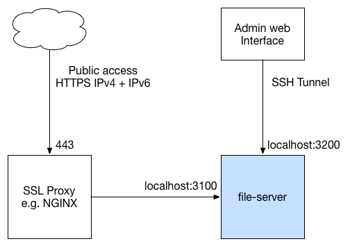

# File Server

A node.js based file server with local admin web interface.

This project came about because I needed a simple way of providing a file download
service that gave me control over when a file was available and logged some basic
stats. A simple web management interface makes it easy to manage the available
files and even create unique non-guessable URLs when needed. Its easy to deploy
and designed for small scale sites in the current version.



This application has 2 HTTP server ports:

* 3100 serves the files
* 3200 is the web admin interface and REST APIs

Both these ports are bound to localhost because they are not designed to be
directly accessed from the internet. The file server should be fronted by
a proxy such as nginx and the admin interface is expected to be accessed remotely
via a SSL tunnel for security.

Files are served by URLs of the form:

```
http://my.domain/<category>/<filename>
```

The web admin UI has configuration screens to create and manage:
* categories:
   * create either a user defined category or generate an 'unguessable' psuedo private category
   * enable/disable/delete existing categories
* files:
   * upload new files
   * enable/disable/delete existing files
* URLs:
   * create a new URL from a category+file
   * enable/disable/delete existing URLs
   * set an optional maximum download count for an URL; when that count is reached
   the URL will be automatically disabled

Download counts are displayed for all of the above.

## Install

```
npm install
```

### Configure

Copy the config.js.example to config.js and edit as necessary. This provides
the minimum configuration to allow the application to boot.

Create the data directory defined in the config.js file.

### Run

```
npm start
```

### Unit tests

With the application running, in another shell:

```
npm test
```
